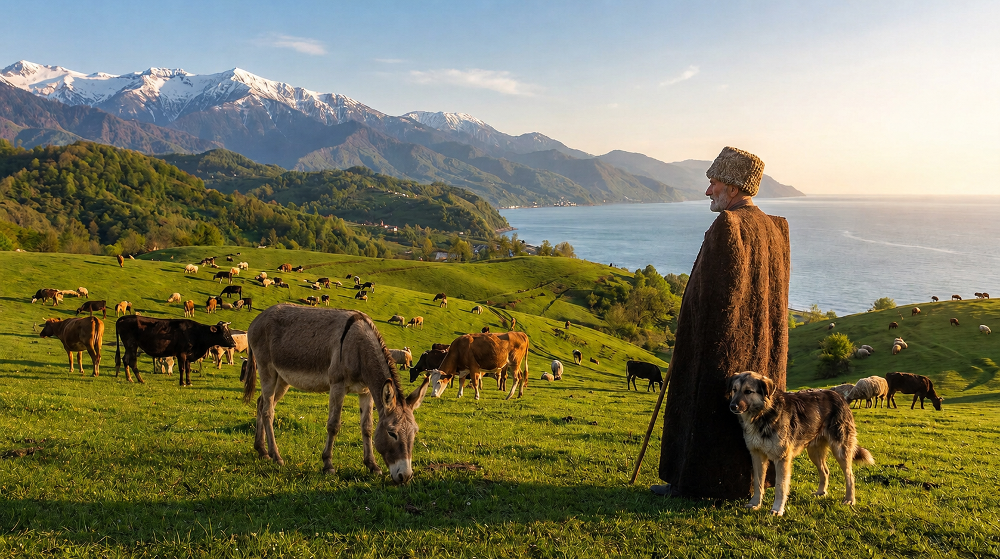
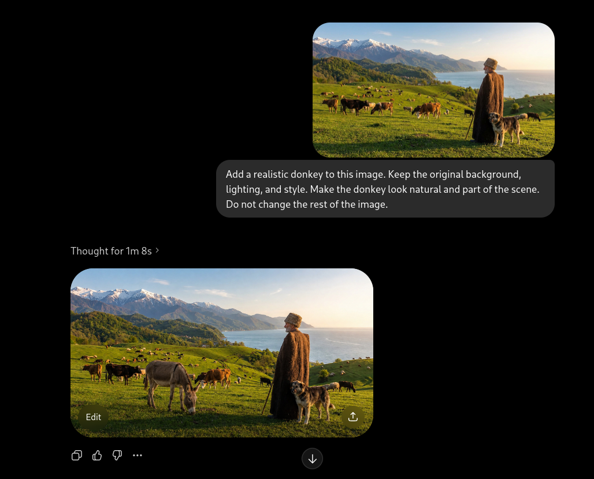
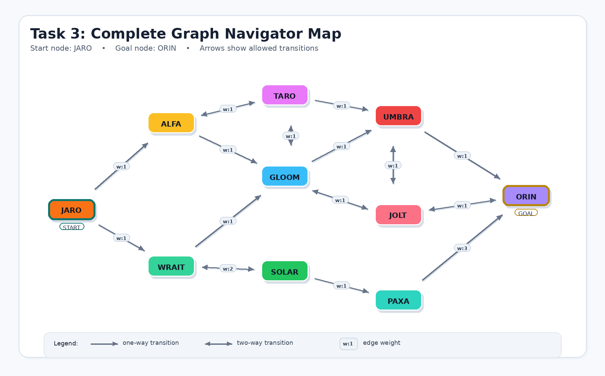

# Introduction to AI Final Exam

Student: Ahmad Khamayseh

---

## Task 1: Using Generative AI

For this task, I used a generative AI image editing tool to add a realistic donkey to the original picture.

Final result:

---

## Task 2: User Manual

### Goal

The goal of this task is to explain how I used a generative AI tool to add a realistic donkey to the original picture.

### AI Tool Used

I used ChatGPT image editing tool. This tool allows the user to upload an image and give a text prompt describing what should be changed in the image.

### Step 1: Open ChatGPT

First, I opened ChatGPT and started a new chat. I used the image editing feature because the task required editing an existing image.

### Step 2: Upload the Original Picture

I downloaded the original picture from the exam link and uploaded it to ChatGPT.

Original picture:

### Step 3: Write the Prompt

After uploading the picture, I wrote the following prompt:

> Add a realistic donkey to this image. Keep the original background, lighting, and style. Make the donkey look natural and part of the scene. Do not change the rest of the image.

The screenshot below shows the uploaded picture, the prompt, and the generated result inside ChatGPT:

### Step 4: Generate the Edited Image

ChatGPT edited the image and added a realistic donkey to the grassy field. The original style, lighting, background, man, dog, cows, mountains, and sea were kept the same as much as possible.

### Step 5: Save the Final Image

Finally, I saved the edited image as `donkey_result.png` and inserted it into this answer file using standard Markdown image syntax.

Final result:

---

## Task 3: Finding the Graph

I explored the Graph Navigator Bot and drew the complete graph.

---

## Task 4: GPA Web Application

The GPA web application is placed inside the `gpa` directory as required.

File:

`gpa/index.html`
